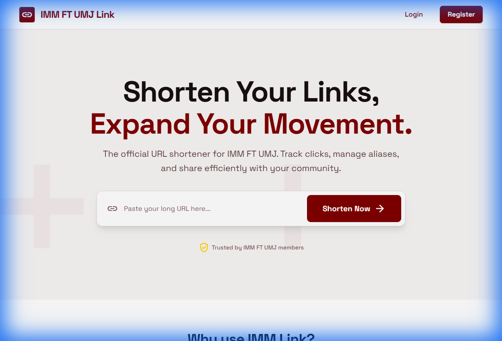
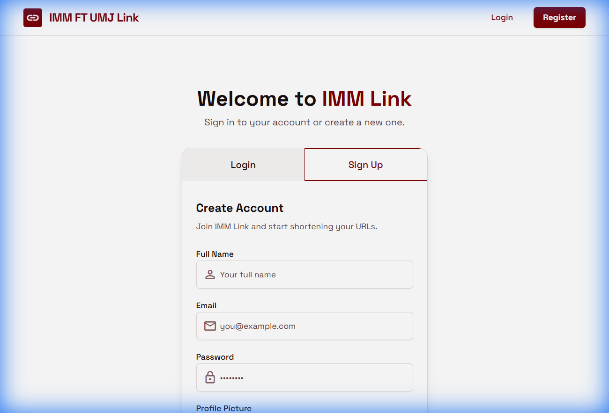

# IMM FT UMJ Link - Simple URL Shortener

A modern, full-featured URL shortener application exclusively designed for IMM FT UMJ community. Built with **React** and **Supabase**, featuring a premium design with Maroon & Gold theme.



## ✨ Features

- **Premium UI/UX** - Modern interface using IMM FT UMJ customized with Space Grotesk font and responsive design
- **URL Shortening** - Transform long URLs into short, memorable links
- **Custom Aliases** - Create branded short links (e.g., `imm.link/event2024`)
- **QR Codes** - Automatic, high-quality QR code generation for every link
- **Advanced Analytics** - Track clicks, device types, and geographic locations in real-time
- **Secure Authentication** - Login/Register with profile picture support
- **Dashboard** - Centralized management for all your links with search and pagination

## 📸 Screenshots

| Login Page | Signup Page |
|:---:|:---:|
|  |  |

## 🛠️ Tech Stack

- **Frontend**: React 19, React Router 7
- **Styling**: Tailwind CSS 4, Radix UI Components, Space Grotesk Font
- **Backend**: Supabase (Database, Auth, Storage)
- **Build Tool**: Vite 7
- **Charts**: Recharts
- **QR Codes**: react-qrcode-logo
- **Notifications**: Sonner

## 🚀 Getting Started

### Prerequisites

- Node.js 18+ installed
- A Supabase account and project

### Installation

1. **Clone the repository:**
   ```bash
   git clone <your-repo-url>
   cd url-shortener
   ```

2. **Install dependencies:**
   ```bash
   npm install
   ```

3. **Set up environment variables:**
   ```bash
   cp .env.example .env
   ```
   
   Update `.env` with your Supabase credentials:
   ```env
   VITE_SUPABASE_KEY=your_supabase_anon_key
   VITE_SUPABASE_URL=https://your-project.supabase.co
   VITE_BASE_URL=http://localhost:5173
   ```

4. **Start the development server:**
   ```bash
   npm run dev
   ```

5. Open [http://localhost:5173](http://localhost:5173) in your browser.

## 📁 Project Structure

```
src/
├── components/       # UI components (Header, Footer, Inputs, Buttons)
├── db/              # Supabase API integration (Auth, Urls, Clicks)
├── hooks/           # Custom hooks (useFetch)
├── layouts/         # App layouts with Toast provider
├── pages/           # Landing, Auth, Dashboard, Link Details
├── context.jsx      # Authentication context
├── index.css        # Global styles & Tailwind configuration
└── main.jsx         # Entry point
```

## 🔧 Available Scripts

| Command | Description |
|---------|-------------|
| `npm run dev` | Start development server |
| `npm run build` | Build for production |
| `npm run preview` | Preview production build |

## 📝 License

MIT License - feel free to use this project for personal or commercial purposes.

## 👨‍💻 Author

**Khalid Jundullah**
